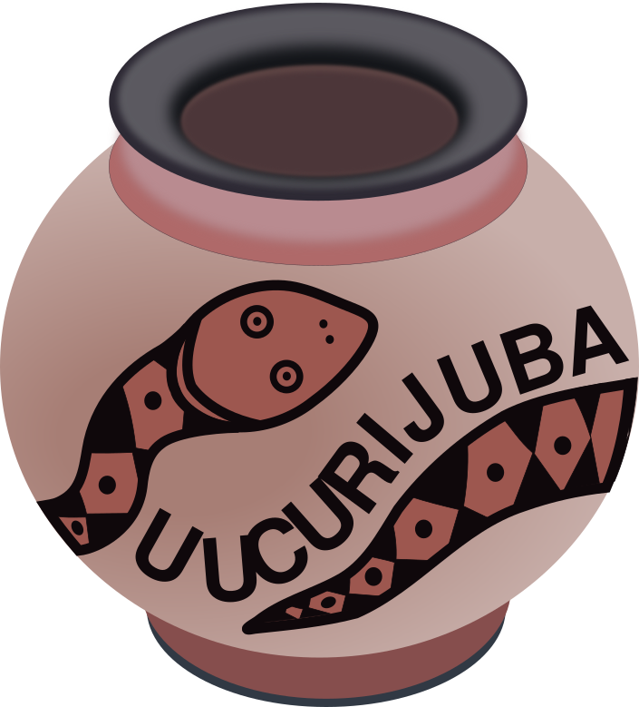

<!---
Open Source program Suucurijuba - Copyright © 2025  Carlo Oliveira** <carlo@nce.ufrj.br>,
PDX-License-Identifier:** `GNU General Public License v3.0 or later <http://is.gd/3Udt>`_.
-->
# Suucurijuba - Um jogo de magia da programação onde você aprende jogando
> E agora para algo totalmente diferente!  
> Aprenda Python resolvendo, modificando e criando desafios e jogos

## Uma História com Muito Envolvimento, onde você é o Herói
Neste jogo você acompanha um enredo complexo com muitas tramas.
E em cada parágrafo você tem que contribuir com seus novos conhecimentos.

## Um Tutorial em Forma de Jogo onde Você é Kiri, a Pajé.
Kiri é uma pequena indígena que escapou de um massacre
em sua aldeia. Por sorte ela ainda lembra dos ensinamentos
do antigo Pajé. Ela lembra da magia da cobra de fogo, a Python Boitatá.

## Ficha Técnica da Plataforma Suucurijuba

**Autor:** `Carlo E. T. Oliveira`  
**Affiliation:** `Universidade Federal do Rio de Janeiro`  
**License:** `GNU General Public License v3 or later (GPLv3+)` 
**Homepage:** [SuuCuriJuba - A cobra que Programa] 
**Changelog:** [CHANGELOG](CHANGELOG.MD) 

[SuuCuriJuba - A cobra que Programa]: http://activufrj.nce.ufrj.br/wiki/labase//SuuCuriJuba
